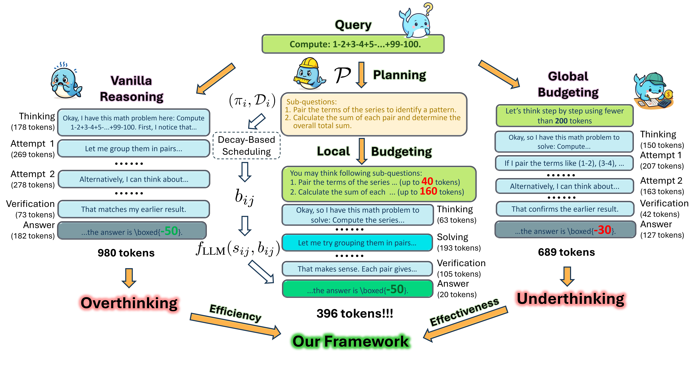

<div align="center">

# 🧠 Plan-and-Budget

## Effective and Efficient Test-Time Scaling on Large Language Model Reasoning

### Accepted at ICLR 2026 🎉

[](https://openreview.net/forum?id=ctspw4CqbS)
[](https://arxiv.org/abs/2505.16122)
[](LICENSE)

<strong>Junhong Lin\*¹</strong>, <strong>Xinyue Zeng\*²</strong>, <strong>Jie Zhu²</strong>, <strong>Song Wang²</strong>, <strong>Julian Shun¹</strong>, <strong>Jun Wu⁴</strong>, <strong>Dawei Zhou²</strong><br> ¹ MIT CSAIL, ² Virginia Tech, ³ University of Virginia, ⁴ Michigan State University

(\*Equal Contribution)

</div>


------------------------------------------------------------------------

<p align="center">

</p>

------------------------------------------------------------------------

# 📌 Overview

**Plan-and-Budget** is a training-free test-time reasoning framework
that improves both **reasoning accuracy** and **efficiency** in large
language models (LLMs).

Modern reasoning LLMs often suffer from:

-   🔄 **Overthinking** --- excessive and redundant reasoning on simple
    queries\
-   ⚡ **Underthinking** --- premature termination on complex tasks

We introduce:

-   **BAM (Budget Allocation Model)** --- a theoretical framework for
    adaptive token allocation\
-   **Plan-and-Budget** --- a practical inference-time implementation
    using structured decomposition and local budget scheduling\
-   **E³ (Efficiency-aware Effectiveness Evaluation)** --- a principled
    metric balancing accuracy and compute

This repository contains the full inference and evaluation pipeline to
reproduce our results.

------------------------------------------------------------------------

# ⚙️ Environment Setup

``` bash
conda create -n plan_budget python=3.12 -y
conda activate plan_budget
pip install vllm
pip install -r requirements.txt
```

------------------------------------------------------------------------

## 🔐 Environment Variables

``` bash
cp .env_template .env
```

Edit `.env`:

-   `API_BASE` (e.g., `http://localhost:7878/v1`)
-   `API_KEY` (use `"DUMMY"` for local vLLM)

You can specify a different config at runtime:

``` bash
ENV_FILE=path/to/your/.env python ...
```

------------------------------------------------------------------------

# 📂 Datasets

Download TravelPlanner database:

https://drive.google.com/file/d/1pF1Sw6pBmq2sFkJvm-LzJOqrmfWoQgxE/view?usp=drive_link

Unzip into:

dataset/TravelPlanner/

Pre-decomposed datasets:

-   dataset/MATH-500\
-   dataset/NaturalInstruction-Sampled-500\
-   dataset/TravelPlanner

To re-run decomposition:

``` bash
python -m dataset.break_down_question \
  --num-workers 32 \
  --queue-size 32 \
  --dataset DATASET_NAME
```

DATASET_NAME ∈ {math, instruction, travelplanner}

------------------------------------------------------------------------

# 🚀 Reproducing Experimental Results

Example (MATH-500):

``` bash
python -m run.run_inf --num-workers 32 --dataset math --model vanilla
python -m run.run_inf --num-workers 32 --dataset math --model planned
python -m run.run_inf --num-workers 32 --dataset math --model global_budget
python -m run.run_inf --num-workers 32 --dataset math --model planned_global
```

Plan-and-Budget (Local Allocation):

``` bash
python -m run.run_inf --dataset math --model planned_local_uniform

python -m run.run_inf --dataset math \
  --model planned_local_weighted \
  --decay polynomial --postfix polynomial
```

`--postfix` only affects log naming.

------------------------------------------------------------------------

# 📊 Evaluation

For MATH-500 and NaturalInstructions: - Results computed automatically.

For TravelPlanner: - Requires structured JSON evaluation via a secondary
LLM.

``` bash
ENV_FILE=.env.eval python -m run.run_eval \
  --dataset travelplanner \
  --model MODEL_NAME \
  --postfix POSTFIX
```

Ensure `.env.eval` specifies a model supporting JSON output.

------------------------------------------------------------------------

# 📚 Citation

``` bibtex
@inproceedings{lin2026plan,
  title={Plan-and-Budget: Effective and Efficient Test-Time Scaling on Large Language Model Reasoning},
  author={Lin, Junhong and Zeng, Xinyue and Zhu, Jie and Wang, Song and Shun, Julian and Wu, Jun and Zhou, Dawei},
  booktitle={International Conference on Learning Representations (ICLR)},
  year={2026}
}
```

------------------------------------------------------------------------

⭐ If you find this repository useful, please consider starring it!
